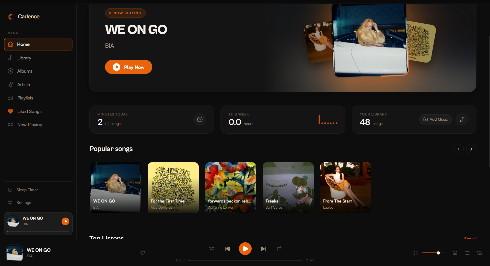
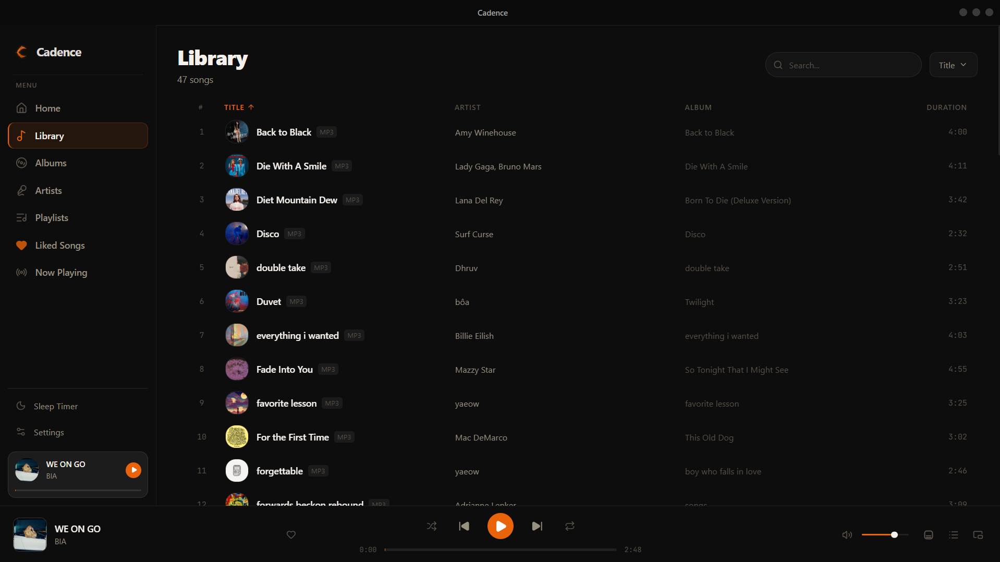

# Cadence

A premium offline music player for Windows built with Tauri, React, Rust, and TypeScript.

Cadence is designed for users who want a beautiful, fast, and privacy-focused desktop music experience without subscriptions, cloud lock-in, or unnecessary bloat.

---

## Screenshots

### Home

### Library

### Now Playing

### Lyrics View

### Mini Player

---

## Features

* 🎵 Local music playback
* 🖼 Album artwork support
* 📝 Synced lyrics
* ❤️ Liked Songs collection
* 📂 Playlist management
* ⏱ Sleep Timer
* 🎧 Mini Player
* 🔍 Fast library searching
* 🪶 Lightweight Rust backend
* 🔒 Privacy-focused offline experience
* 🐞 Built-in bug reporting
* 💡 Feature request system
* 🎨 Modern Windows-inspired UI

---

## Downloads

Download the latest release from:

https://github.com/NikhilKshub/Cadence/releases

Available installers:
* Windows Installer (.msi)
* Windows Setup (.exe)

---
## System Requirements
### Supported Operating Systems

* Windows 10
* Windows 11

## Feedback

Cadence includes a built-in **Help & Feedback** section.

Users can:

* Report bugs
* Suggest features
* Copy diagnostics information

directly from the Settings page.

---

## Roadmap

Planned future updates:

* Discord Rich Presence
* Automatic update system
* Additional themes
* Advanced playlist tools
* Audio enhancements
* Performance improvements

---

## Built With

* Tauri 2
* React
* TypeScript
* Rust
* Zustand
* Tailwind CSS
* Howler.js

---

## Author

Nikhil Kunwar

---

## License

All Rights Reserved.

Cadence is proprietary software.

No permission is granted to copy, modify, distribute, republish, sublicense, or create derivative works from this software or its source code without explicit written permission from the author.
